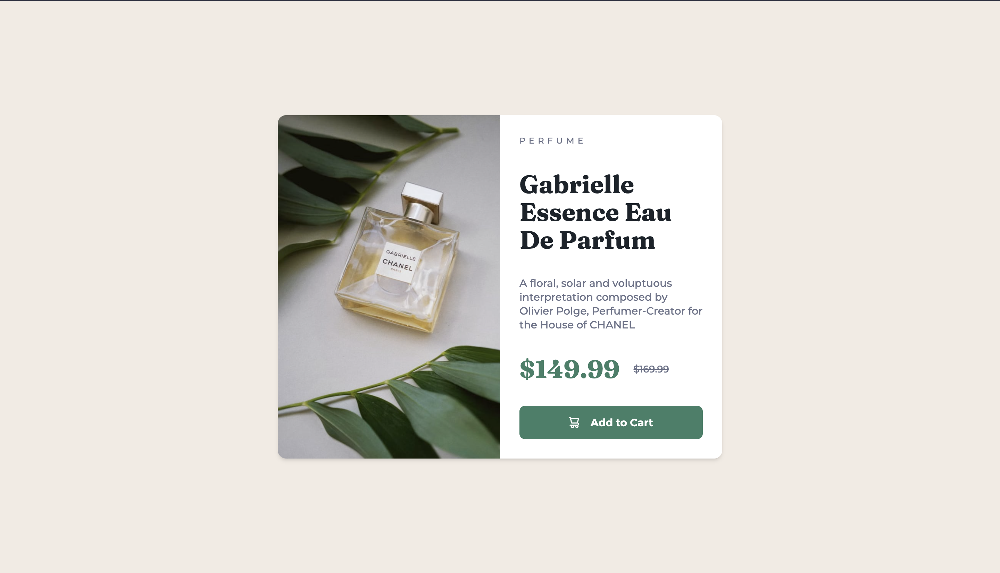
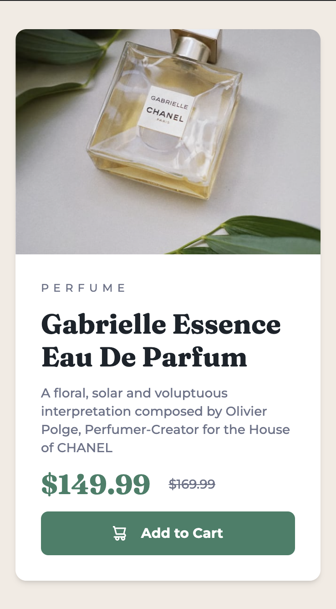

# Frontend Mentor - Product preview card component solution

This is a solution to the [Product preview card component challenge on Frontend Mentor](https://www.frontendmentor.io/challenges/product-preview-card-component-GO7UmttRfa). Coded by Muniru Issah.

## Table of contents

- [Overview](#overview)
    - [The challenge](#the-challenge)
    - [Screenshot](#screenshot)
    - [Links](#links)
- [My process](#my-process)
    - [Built with](#built-with)
    - [Awesome Sections](#awesome-sections)
- [Author](#author)

## Overview

### The challenge

Users should be able to:

- View the optimal layout depending on their device's screen size
- See hover and focus states for interactive elements

### Screenshot
#### Desktop

#### Mobile


### Links

- Solution URL: [GitHub Repository](https://github.com/MuniruIssah/product-preview-card)
- Live Site URL: [Add live site URL here](https://your-live-site-url.com)

## My process

### Built with

- Semantic HTML5 markup
- CSS custom properties
- Mobile-first workflow
- [React](https://reactjs.org/) - JS library
- [Gatsby.js](https://www.gatsbyjs.com/) - React framework
- [Tailwind](https://tailwindcss.com/) - For styles

### Awesome sections
Here are some snippets of the code that I think are awwwwesome:


```html
<h1>Some HTML code I'm proud of</h1>
```
```css
.image-bg{
   @apply w-full h-full  bg-cover bg-no-repeat  w-full h-full min-h-[37vh];
   background-image: url("../images/image-product-desktop.jpg");
 }
@media screen and (max-width: 1023px) {
  .image-bg{
    background-image: url("../images/image-product-mobile.jpg");
  }
}
```


## Author

- Website - [Issah Muniru](https://muniruissah.github.io/muniru-issahs-portfolio/)
- Frontend Mentor - [@MuniruIssah](https://www.frontendmentor.io/profile/MuniruIssah)
- Twitter - [@ningen_dewa_nai](https://www.twitter.com/ningen_dewa_nai)
